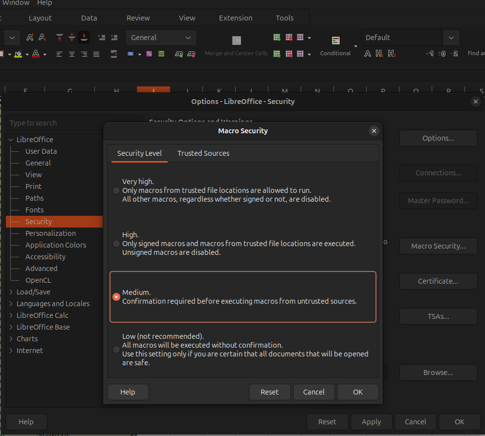
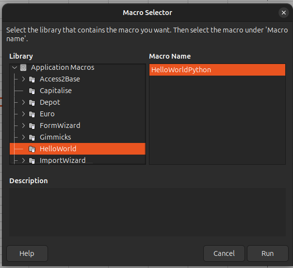
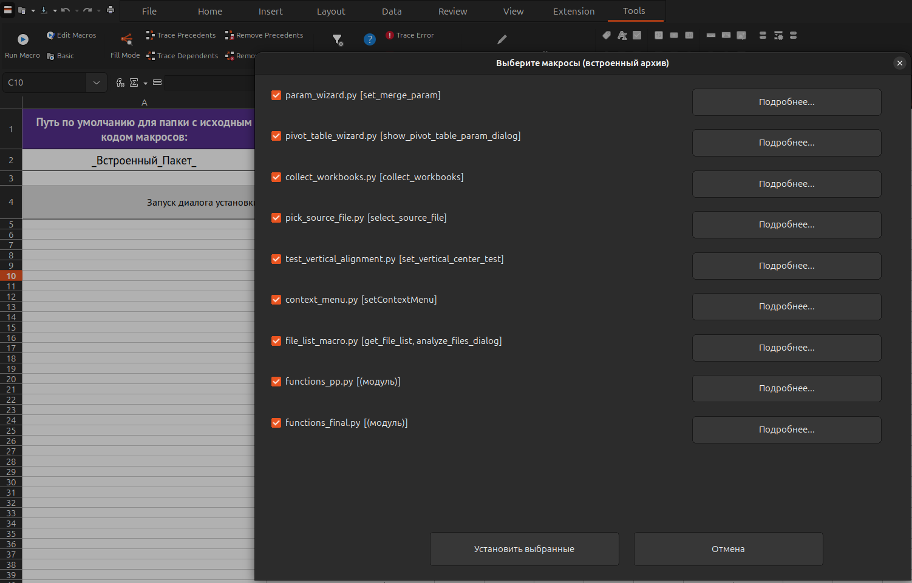

# Установка макросов libre-macros (для пользователя)

Краткое руководство: как установить макросы в **AlterOffice ACell** или **LibreOffice Calc** из одного файла **`MacroInstaller_bundled.ods`**.

Внутри этой книги уже есть все нужные `.py` — отдельно скачивать репозиторий или выбирать папку с исходниками **не нужно**.

Полное руководство для разработчиков: [INSTALL_GUIDE.md](INSTALL_GUIDE.md).

> **Иллюстрации** — в каталоге [`figs/02_INSTALL_USER/`](figs/02_INSTALL_USER/).  
> Подпись со ссылкой «скриншот» + вставка ниже: на GitHub картинка inline, в Cursor при сбое превью — **Ctrl+клик** по ссылке.

---

## 1. Что понадобится

- **AlterOffice** (ACell) или **LibreOffice Calc** с поддержкой Python-макросов (PyUNO).
- Файл **`MacroInstaller_bundled.ods`** (его вам передают вместе с комплектом макросов).

### Разрешение на выполнение макросов

**Сервис → Параметры → Безопасность → Безопасность макросов**

Для установщика нужен уровень, при котором разрешено выполнение макросов из документа (средний с подтверждением или низкий уровень - когда все разрешены - после установки верните настройки как минимум на уровень medium).

> **Рис. 1** — уровень безопасности, допускающий запуск макросов из открытого документа. · [скриншот](figs/02_INSTALL_USER/fi1.png)

### Проверка (НЕОБЯЗАТЕЛЬНО), что макросы вообще работают

1. Откройте ACell или Calc.
2. **Сервис → Макросы → Выполнить макрос…**
3. Запустите любой тестовый макрос Python (в AlterOffice — **Макросы AlterOffice → HelloWorld → HelloWorldPython**).

> **Рис. 2** — проверка, что Python-макросы выполняются в вашей установке офиса. · [скриншот](figs/02_INSTALL_USER/fi2.png)

---

## 2. Установка из MacroInstaller_bundled.ods

### Шаг 1. Откройте файл

1. Сохраните `MacroInstaller_bundled.ods` на диск (например, в «Загрузки»).
2. Откройте его **двойным щелчком** в ACell / Calc.

На листе указаны:

| Ячейка | Содержимое |
|--------|------------|
| **A2** | `_Встроенный_Пакет_` — признак, что макросы берутся из файла, а не с диска |
| **B2** | номер версии комплекта |

> **Рис. 3** — открытый `MacroInstaller_bundled.ods` с признаком встроенного пакета и номером версии. · [скриншот](figs/02_INSTALL_USER/fi3.png)

### Шаг 2. Запустите установщик

**Способ А (кнопка на листе)**

1. Нажмите **«Запуск диалога установки»**.

> **Рис. 4** — запуск установщика кнопкой на листе (способ А). · [скриншот](figs/02_INSTALL_USER/fi4.png)

**Способ Б (через меню)**

1. **Сервис → Макросы → Выполнить макрос…**
2. Разверните имя **этого документа** (не «Мои макросы»).
3. **Python → `installer_bundled` → `install_macros`**
4. **Выполнить**

> **Рис. 5** — запуск установщика через меню (способ Б). · [скриншот](figs/02_INSTALL_USER/fi5.png)

При запросе безопасности — **Разрешить**.

> **Рис. 6** — подтверждение выполнения макроса из документа. · [скриншот](figs/02_INSTALL_USER/fi6.png)

### Шаг 3. Выберите макросы

Откроется окно **«Выберите макросы (встроенный архив)»**:

- отмечены все найденные макросы;
- кнопка **«Подробнее…»** — краткое описание файла;
- снимите галочки с ненужных;
- нажмите **«Установить выбранные»**.

> **Рис. 7** — окно выбора макросов из встроенного архива. · [скриншот](figs/02_INSTALL_USER/fi7.png)

Диалог **выбора папки не появится** — файлы уже внутри `MacroInstaller_bundled.ods`.

### Шаг 4. Готово

В сообщении будет указано, сколько файлов скопировано и куда.

> **Рис. 8** — результат установки: число скопированных файлов и каталог назначения. · [скриншот](figs/02_INSTALL_USER/fi8.png)

Макросы попадают в профиль пользователя:

| ОС | Типичный путь |
|----|----------------|
| Linux (AlterOffice) | `~/.config/alteroffice/5/user/Scripts/python/` |
| Linux (LibreOffice) | `~/.config/libreoffice/4/user/Scripts/python/` |
| Windows (AlterOffice) | `%AppData%\AlterOffice3\4\user\Scripts\python\` |

Точный путь: **Сервис → Параметры → Пути → Макросы**.

**Перезапустите ACell / Calc** — после этого макросы появятся в **Мои макросы → Python**.

> **Рис. 9** — список модулей в профиле пользователя после перезапуска. · [скриншот](figs/02_INSTALL_USER/fi9.png)

---

## 3. Что установлено

| Макрос | Для чего |
|--------|----------|
| `collect_workbooks` | Объединение данных из нескольких книг Calc |
| `param_wizard` | Визард параметров и пресеты на листе «Параметры_Объединения» |
| `pick_source_file` | Выбор файла в строку «Файлы-Источники» |
| `context_menu` | Настройка контекстного меню ячейки |
| `file_list_macro` | Отчёт о файлах в папке |
| `functions_pp` | Пользовательские функции постобработки (`functions_pp.py#…`) |
| `functions_final` | Пользовательские функции финальной обработки (`functions_final.py#…`) |

Вместе с макросами копируется каталог **`pythonpath/`** (общая библиотека `libre_macros_lib.py`).

Подробные инструкции по работе — в отдельных файлах документации (если они входят в ваш комплект).

---

## 4. Первый запуск после установки

### Запуск из меню

1. Откройте рабочую книгу (для сбора данных — с листом **«Параметры_Объединения»**).
2. **Сервис → Макросы → Выполнить макрос…**
3. **Мои макросы → Python →** имя модуля **→** функция **→ Выполнить**

| Модуль | Функция | Назначение |
|--------|---------|------------|
| `collect_workbooks` | `collect_workbooks` | Запуск сбора книг |
| `param_wizard` | `set_merge_param` | Редактирование параметров |
| `pick_source_file` | `select_source_file` | Выбор файла-источника |
| `context_menu` | `setContextMenu` | Установка пунктов контекстного меню |
| `file_list_macro` | `analyze_files_dialog` | Список файлов в папке |

### Контекстное меню ячейки (рекомендуется)

Один раз после установки:

1. **Сервис → Макросы → Выполнить макрос…**
2. **Мои макросы → Python → `context_menu` → `setContextMenu`**
3. Отметьте нужные пункты → **Установить**
4. **Перезапустите ACell / Calc**

> **Рис. 10** — выбор пунктов, которые появятся в контекстном меню ячейки. · [скриншот](figs/02_INSTALL_USER/fi10.png)

После этого макросы можно вызывать **правым щелчком по произвольной ячейке призвольного листа любой книги ACell / Calc**.

> **Рис. 11** — вызов макросов правым щелчком по ячейке. · [скриншот](figs/02_INSTALL_USER/fi11.png)

---

## 5. Частые проблемы

| Симптом | Что сделать |
|---------|-------------|
| Кнопка не реагирует / ошибка макроса | Разрешите макросы в настройках безопасности; откройте файл с диска, не из временной несохранённой копии |
| «Не найдено ни одного .py» | Возьмите целый `MacroInstaller_bundled.ods` заново — файл мог быть повреждён или пересохранён без встроенного архива |
| Макросы не видны в меню | Перезапустите ACell / Calc; проверьте каталог **Макросы** в параметрах |
| Снова просит выбрать папку | Документ не сохранён на диск — сохраните `.ods` и повторите установку |
| Ошибка при нажатии кнопки `takes 0 positional arguments` | Используйте актуальный `MacroInstaller_bundled.ods` из комплекта поставки |
| При сохранении просит пароль / «документ защищён» | Файл открывается **только для чтения** — для установки макросов пароль **не нужен**; не пересохраняйте книгу без необходимости |

### Как открыть установщик на запись (для разработчиков)

Пароль по умолчанию: `macros_libre_123456` (или из `installer/installer_password.txt` / `MACRO_INSTALLER_PASSWORD` при сборке).

1. Откройте `MacroInstaller_bundled.ods` в Calc / AlterOffice — в заголовке окна обычно видно **«Только для чтения»**.
2. **Файл → Свойства → Защита** (в AlterOffice может называться **Параметры документа → Безопасность**):
   - снимите **«Открывать файл только для чтения»**, если нужно редактировать лист;
   - при запросе введите **пароль на изменение** (тот же, что при сборке).
3. Альтернатива: **Правка → Режим «только для чтения»** — переключите выкл.; при наличии пароля на запись Calc может запросить его.
4. После правок сохраните книгу (**Ctrl+S**) — снова потребуется пароль на изменение, если защита включена при следующей сборке.

Для обычной установки макросов (кнопка на листе) снимать защиту **не нужно**.

---

## 6. Повторная установка / обновление

1. Получите новый **`MacroInstaller_bundled.ods`** (с более новой версией в ячейке **B2**).
2. Повторите установку (§2).
3. В диалоге выберите макросы для перезаписи — существующие файлы в `Scripts/python` будут заменены.
4. Перезапустите ACell / Calc.

---

*Документ для конечных пользователей. Сборка установщика и установка из исходников — в [INSTALL_GUIDE.md](INSTALL_GUIDE.md).*
