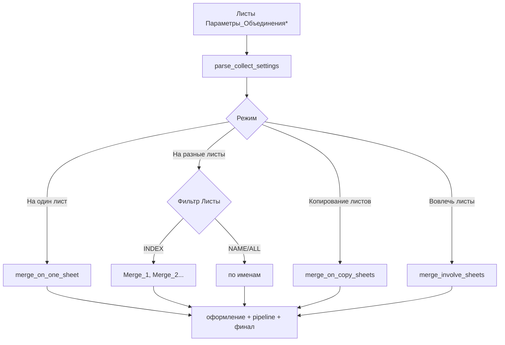

# Описание логики сбора данных из источников

**Версия макроса**: **3.10.581** (`macro-lib/version.txt` / `MACRO_VERSION` в `collect_workbooks.py`).

**Актуальность**: документ синхронизирован с кодом `collect_workbooks.py` и `pythonpath/`. Ключевые возможности:

- Четыре режима: **На один лист**, **На разные листы**, **Копирование листов**, **Вовлечь листы**
- Оркестратор **`collect_pack`** — несколько листов параметров, порядок, журналы `Сбор_книг_лог_N` ([18_ORCHESTRATOR.md](18_ORCHESTRATOR.md))
- **`xml_excel_ods`** — прямой перенос через файл; отложенная UNO-постобработка ([17_POSTPROCESS_XML.md](17_POSTPROCESS_XML.md))
- **`MERGE_XML_CONVERT_TO_NUMBERS`** / **`MERGE_XML_DATETIME_FORMATS`** — текст → число/дата (для вовлечённых preexisting-листов UNO-convert **пропускается**); month-only шаблоны `FIRST_DAY.MMMM.YEAR` и т.п. — [15_PARAM_REFERENCE.md](15_PARAM_REFERENCE.md)
- Маркер текущей книги: гибкая нормализация `эта_книга` / `ThisWorkbook` / …
- **Многоэтажные заголовки** — `Строка_Заголовков`: число в B или JSON в C (`rows`, `separator`); сборка имён с объединениями ([15_PARAM_REFERENCE.md](15_PARAM_REFERENCE.md))
- Pipeline: `Постобработка_*`, `ВПР` (`join_type` left/inner/full, `multi_match` all/first/last, диапазоны `left.range`/`right.range`), **`объединить_листы_в_один`**, **`разделить_листы`** (`run_phase`), `Финальная_обработка`
- Новые RANGE: **`разделить_по_столбцам`**, **`условный_столбец`**, **`столбец_по_лямбде`**, **`добавить_столбец`**, **`текстовые_операции`**
- Параметры **`Листы_удалить`**, **`Добавить_в_карту_переменных`**
- Колонка C — **только JSON** ([13_JSON_PARAMS.md](13_JSON_PARAMS.md))
- AO 2026: константы и логика в `pythonpath/`; entry — тонкие обёртки

---

## 1. Реализованные возможности

| Функция | Статус | Описание |
|---------|--------|----------|
| Режим «На один лист» | ✅ | Слияние в листы по имени или `Merge_N` |
| Режим «На разные листы» | ✅ | INDEX → `Merge_N`; NAME/ALL → по именам |
| Режим «Копирование листов» | ✅ | xlsx/ods: `importSheet`; `.csv`: текст→`setDataArray`; оформление/обрезка |
| Режим **«Вовлечь листы»** | ✅ | Без копирования: вкладки `эта_книга` → pipeline/финал; pre-clear выкл. |
| Оркестратор `collect_pack` | ✅ | Multi-param, порядок, reset DB, журналы `_N` |
| Относительные пути / маски | ✅ | Относительно каталога книги параметров |
| Маркер текущей книги | ✅ | `Эта_книга`, `эта-книга`, `ThisWorkbook`, `This_Workbook`, `current`, … |
| `Ячейка_В_Столбец` | ✅ | Ячейка источника → столбец результата |
| `Пропуск_строк_источника` / `удаление_верхних_строк` / `пропуск_пустых_строк` | ✅ | JSON в C |
| `объединить_листы_в_один` / `разделить_листы` | ✅ | Отдельные строки A, `kind=merge_sheets` / `split_sheets` |
| Многоэтажные заголовки (`Строка_Заголовков`) | ✅ | B — одна строка; B=`смотри в C` + JSON `rows`/`separator` |
| `Листы_удалить` / `Добавить_в_карту_переменных` / `Ручной_ввод_в_карту_переменных` | ✅ | Фильтры листов и runtime-карта (+ ручной ввод) |
| `разделить_по_столбцам` / `условный_столбец` / `столбец_по_лямбде` / `добавить_столбец` | ✅ | RANGE/финал, JSON в C |
| Несколько листов параметров | ✅ | Группа `Параметры_Объединения*` |
| Визард / пресеты / pick_source | ✅ | `param_wizard`, `pick_source_file` |

---

## 1.1 Листы «Параметры_Объединения*» (группа)

Таблица настроек размещается на листе, имя которого **начинается с** `Параметры_Объединения` (`Параметры_Объединения`, `Параметры_Объединения_1`, …).

| Ситуация | Поведение |
|----------|-----------|
| **Один** лист группы | Параметры читаются с него при запуске `collect_workbooks` с **любого** активного листа |
| **Несколько** + `collect_workbooks` | Нужен **активный** лист группы |
| **Несколько** + `collect_pack` | Диалог выбора/порядка; заранее активировать не обязательно ([18_ORCHESTRATOR.md](18_ORCHESTRATOR.md)) |
| Этап 1 → этап 2 | Лист запоминается (`set_run_param_sheet`) |
| Служебность | Не вовлекаются как данные; защищены от удаления; журналы `Сбор_книг_лог*` тоже служебные |

Ключевые функции: `is_param_sheet_name`, `list_param_sheet_names`, `resolve_param_sheet_for_run`, `set_run_param_sheet`, `get_run_param_sheet`, `collect_workbooks_for_param_sheet`.

---

## 2. Архитектура сбора



**Точки входа:**

| Макрос | Назначение |
|--------|------------|
| `collect_workbooks` | Один конфиг (этап 1 → этап 2) |
| `collect_pack` | Оркестратор нескольких конфигов |
| `collect_reset_db_ranges` | Сброс DatabaseRange + простой автофильтр (из pack или отдельно) |
| `collect_workbooks_reopen` | Служебный reopen |

**Режим — точка ветвления:**

- **На один лист** → `merge_on_one_sheet`
- **На разные листы** → INDEX / NAME/ALL
- **Копирование листов** → `merge_on_copy_sheets`
- **Вовлечь листы** → `merge_involve_sheets`: только маркер текущей книги; данные не копируются; `maybe_clear_sheets` не вызывается; далее pipeline и финал на указанных вкладках

---

## 2.1 Режим «Вовлечь листы»

| Аспект | Поведение |
|--------|-----------|
| `Файлы-Источники` | Только маркер текущей книги (`эта_книга` / `ThisWorkbook` / …); внешние пути — ошибка |
| `Листы` | Какие вкладки **текущей** книги обработать (имена, шаблоны, номера, `Все`) |
| Перенос данных | Нет (`Merge` / копии не создаются) |
| Pre-clear | Всегда выкл. |
| `Строка_Заголовков` | Задаёт `header_row` для pipeline |
| `Столбцы`, `Начало_*`, `Ячейка_В_Столбец`, `Способ_переноса` | Игнорируются |
| Оформление по умолчанию | Не навязывается (preexisting); явная постобработка/финал — да |
| UNO текст→число | Пропускается на preexisting (как и вовлечение) |
| Финал | Только на **вовлечённых** листах |
| `collect_reset_db_ranges` после pack | Автофильтр только на вовлечённых |

Синонимы режима (после нормализации): `вовлечь_листы`, `involve_sheets`, `passthrough`, `без_копирования`, `только_обработка`.

Минимальный пример:

```
Файлы-Источники | эта_книга
Режим            | Вовлечь листы
Листы            | Отчет
Строка_Заголовков| 1
Финальная_обработка | сортировка | [{"v":1,"fn":"сортировка","sheet":"Отчет","keys":[{"column":"A","desc":false}]}]
```

---

## 3. Режим «На один лист»

**Принцип**: данные из разных файлов собираются в книгу результата; **имя листа результата** зависит от типа фильтра «Листы».

| Аспект | Поведение |
|--------|-----------|
| Фильтр по **имени/шаблону** (`Отчет*`, `Январь`) | Листы с **одинаковым именем** из разных источников сливаются на **один** лист результата с этим именем |
| Фильтр по **номерам** (`1`, `2`, `3`) | Данные попадают на листы `Merge_1`, `Merge_2`, … по номеру (без совпадения имён в источниках) |
| Служебные колонки | Опционально `#Путь` и/или `#ДатаВремяФайла` (см. параметры ниже); по умолчанию обе скрыты |
| Слияние столбцов | По **имени заголовка** — одинаковые заголовки → один столбец |
| Повторный сбор | Вопрос: очистить существующий лист (кроме строки 0) или дописать в первую пустую строку |

**Псевдокод**:
```
for each file in files:
    for each sheet matching sheet_filter:
        target = sheet_by_name OR "Merge_" + index
        copy data to target (merge columns by header name)
```

---

## 4. Режим "На разные листы"

### 4.1 Фильтр по ИНДЕКСАМ (`sheet_kind = INDEX`)

**Принцип**: для каждого указанного индекса создаётся лист `Merge_N`, туда собираются листы с этим индексом из всех файлов.

| Параметр | Значение |
|----------|----------|
| Имена листов результата | `Merge_1`, `Merge_2`, ... (по номерам из фильтра) |
| Что собирается в Merge_1 | Лист с индексом 0 (первая вкладка) из каждого файла-источника |
| Что собирается в Merge_2 | Лист с индексом 1 (вторая вкладка) из каждого файла-источника |

**Пример**: фильтр `1,2` → создаются `Merge_1` и `Merge_2`. В `Merge_1` попадают данные из листа 1 (индекс 0) каждого файла, в `Merge_2` — из листа 2 (индекс 1).

**Примечание**: В фильтре индексы задаются **1-based** (как в UI: 1 — первый лист), но в коде конвертируются в **0-based**.

### 4.2 Фильтр по ИМЕНАМ (`sheet_kind = NAME`)

**Принцип**: листы результата именуются по именам листов источников, одноименные листы из разных файлов объединяются.

| Параметр | Значение |
|----------|----------|
| Имена листов результата | Имена найденных листов (без префикса Merge_) |
| Слияние | Все листы с именем "Отчет" из разных файлов → в один лист "Отчет" в результате |
| Матчинг столбцов | По **имени заголовка** — одинаковые заголовки → один столбец |
| Служебные колонки | `#Путь` (A), `#ДатаВремяФайла` (B) — создаются и заполняются |

**Пример**: файлы содержат листы `Январь`, `Февраль`. Фильтр `*` → создаются `Январь` и `Февраль`. В `Январь` попадают данные из листов "Январь" всех файлов.

### 4.3 Фильтр ВСЕ (`sheet_kind = ALL`)

**Принцип**: как NAME, но включаются все листы каждого файла.

### 4.4 Режим «Копирование листов»

**Принцип:** целые вкладки копируются из источников в книгу результата (`importSheet` / `copyByName`), **без** слияния таблиц по заголовкам.

Для **`.csv`**: по умолчанию файл читается как текст → таблица в памяти с распознаванием чисел/дат → новый лист + `setDataArray`. Если в доп. параметрах `"copy_whole_sheet": true` — открытие в Calc и `importSheet` (лист целиком), как у xlsx/ods.

| Аспект | Поведение |
|--------|-----------|
| Способ по умолчанию | UNO `По_API` |
| `.csv` | По умолчанию: матрица→`setDataArray`; при `copy_whole_sheet`: Calc+`importSheet` |
| `xml_excel_ods` | UNO-копирование → save → close → правка **файла** на диске (обрезка, числа/даты, xml) → reopen → UNO-постобработка **после показа** книги |
| Встроенное оформление | Да (`apply_result_sheet_formatting` / отложенная UNO-фаза при `xml_excel_ods`) |
| `Ячейка_В_Столбец` | Для xlsx/ods — снимок с источника; для CSV — **не применяется** |
| `#Путь` / `#ДатаВремяФайла` | **Не добавляются** |
| Обрезка строк | Авто по `Строка_Заголовков` / `Начало_Строка` per файл, если нет явного `удаление_верхних_строк` |
| Строка заголовка после обрезки | После автообрезки шапка оказывается в **строке 1** листа результата; для оформления и pipeline `header_row` берётся через `_merge_result_header_row` (обычно **0**), а не как `Строка_Заголовков − 1` источника |

### 4.5 Способ переноса `xml_excel_ods`

Книга результата **должна быть сохранена** на диск. На время direct-фазы документ **закрывается** и открывается снова (Hidden).

| Этап | Что происходит |
|------|----------------|
| Сбор | UNO или direct-запись в файл |
| Direct в файле | `Постобработка_xml`, `удаление_верхних_строк`, [copy] распознавание текстовых **чисел и дат** |
| Reopen | Hidden; очередь отложенной UNO-постобработки |
| Финал этапа 2 | Показ книги → оформление + `Постобработка_Диапазон` / `Строка` + `Финальная_обработка` |

Подробно: [17_POSTPROCESS_XML.md](17_POSTPROCESS_XML.md).

---

## 5. Пути к источникам (`P_MERGE_FILES`)

### 5.1 Типы путей

| Тип | Пример | Обработка |
|-----|--------|-----------|
| Абсолютный | `/home/user/data.xlsx`, `C:\Data\file.csv` | Как есть |
| Относительный | `data/file.xlsx`, `..\reports\*.csv` | Относительно **каталога текущей книги** (где лист параметров) |
| Маска glob | `sources/*.xlsx`, `reports\*.csv` | Разворачивается в список файлов |
| С плейсхолдером карты | `…/<<Переменные.Филиал>>_one_sheet.xlsx`, `*<<Переменные.Код>>*` | `<<Переменные.имя>>` подставляется **до** разворота масок из runtime-карты (глобальные + ручной ввод **выше** «Файлы-Источники»). В `collect_pack` проверка наличия файлов при плейсхолдерах / ручном вводе выше — **после** диалога при реальном сборе, не на этапе prevalidate. |
| Специальный | `Эта_книга`, `ThisWorkbook`, … | Текущая книга без повторного открытия (см. §5.3) |

Поддерживаемые расширения: `.xlsx`, `.xlsm`, `.xls`, `.ods`, `.xml`, `.csv`.
Для `.csv` разделитель и кодировка задаются в `Доп_Параметры_Источника`
(`{"delimiter":";","encoding":"windows-1251"}`); пустая строка параметра → `;` и Windows-1251.
Для CSV / XML / книги общие ключи отбора: `exclude_mask`, `file_pick` / `file_pick_scope` / `file_pick_lambda`
(см. [15_PARAM_REFERENCE.md](15_PARAM_REFERENCE.md)).

**Общее правило для CSV** (режимы «На один лист», «На разные листы», «Копирование листов»):
текст → матрица в памяти → числа/даты в памяти (`MERGE_XML_CONVERT_TO_NUMBERS`) → вывод на лист(ы) результата через `setDataArray` (без UNO `open_source` / Calc CSV-фильтра).

Исключение в режиме **«Копирование листов»**: если в `Доп_Параметры_Источника` задано `"copy_whole_sheet": true`, CSV открывается в Calc и лист копируется целиком (`importSheet`), как у обычных книг. Отдельный проход текст→число/дата не выполняется (независимо от `MERGE_XML_CONVERT_TO_NUMBERS`).

- **По заголовкам** (`По_API`, `буфер_по_заголовкам`) — столбцы матчятся по имени шапки.
- **Буфер по позиции** — прямоугольник в порядке столбцов источника (как позиционное копирование).
- Чанки записи — `MERGE_COPY_ROW_CHUNK` (в режиме «Диалог» — через `_merge_ui_dialog_copy_chunk`).
- Лог таймингов в консоль: префикс `[CSV]`.

**Книги ODS / XLS / XLSX / XLSM — опциональная подготовка в памяти** (`Доп_Параметры_Источника`):

При `"prepare_source_in_memory": true` в режимах «На один лист» / «На разные листы» и способах
`Буфер_по_заголовкам` / `Буфер_по_позиции` источник читается бандлами (`openpyxl` / `odfpy`)
в матрицу чанками (`chunk_rows`, default 50000) → `setDataArray`, **без** открытия книги в Calc.
По умолчанию флаг выключен — поведение как раньше (UNO `open_source`).

- `.xls` → временный `.xlsx` через UNO-конвертацию, затем openpyxl.
- Субпараметры: `values_mode`, `merged_cells`, `trim_empty`, `convert_types`, `chunk_rows`
  (см. [15_PARAM_REFERENCE.md](15_PARAM_REFERENCE.md) § `Доп_Параметры_Источника`).
- Лог: `[MEM]` / `[ODS-MEM]` / `[XLS-MEM]`.
- Не действует для `По_API`, `xml_excel_ods`, «Копирование листов», URL/smb, `эта_книга`.

### 5.2 Правила преобразования путей

**Определение базового каталога**:
```python
base_dir = os.path.dirname(path_to_current_workbook)
# Windows: C:\Users\User\Documents\
# Linux:   /home/user/documents/
```

**Нормализация**:
- Разделители: `/` и `\` приводятся к нативным для ОС
- `..` и `.` разрешаются через `os.path.normpath`

**Кросс-ОС (Linux ↔ Windows)**:
- При запуске на **Windows** пути в Unix-нотации (`/home/...`, `/mnt/c/...`) преобразуются:
  - `/mnt/c/Users/...` → `C:\Users\...`
  - `/cygdrive/c/...` → `C:\...`
  - прочие `/...` → `\\wsl.localhost\<дистрибутив>\...` (дистрибутив из `WSL_DISTRO_NAME` или `Ubuntu`)
- При запуске на **Linux** пути `C:\...` / `C:/...` → `/mnt/c/...`
- Если пути в параметрах **изменены**, макрос **останавливается** до сбора с сообщением:
  «Пути источников трансформированы… проверьте корректность и запустите макрос снова».
  Ячейки B,C,D… строки «Файлы-Источники» обновляются автоматически.

**Относительные пути**:
```python
# Вход: "data/file.xlsx" на Windows, книга в C:\Docs\
# Результат: C:\Docs\data\file.xlsx

# Вход: "../reports/*.xlsx" на Linux, книга в /home/user/project/
# Результат: /home/user/reports/*.xlsx
```

### 5.3 Специальный путь — маркер текущей книги

**Каноническая запись в ячейку:** `Эта_книга` (`MERGE_CURRENT_BOOK_MARKER`).

**Распознавание** (`is_current_book_marker` / `merge_normalize_current_book_marker_key`): без учёта регистра; пробелы, `_`, `-`, `.` игнорируются; ё→е.

| Семья | Примеры (все → True) |
|-------|----------------------|
| RU | `эта_книга`, `Эта-Книга`, `этакнига`, `Эта книга` |
| EN this | `ThisWorkbook`, `This_Workbook`, `this-workbook`, `ThisBook`, `this_book` |
| EN current | `CurrentWorkbook`, `current_book`, `current` |

**Не** маркеры: пути, маски, слова `книга` / `Workbook` без префикса.

**Поведение при сборе (ONE/MANY/COPY):**

- Файл **не** открывается через `open_source`
- Документ — `get_run_target_doc()` / книга результата
- Листы по `iter_sheet_slots` / `_iter_sheet_slots_current_book`
- Служебные вкладки исключаются

В режиме **«Вовлечь листы»** внешние пути запрещены; несколько маркеров схлопываются в один источник.

---

## 6. Границы блока и фильтры

Без изменений от текущей версии:

| Параметр | Описание |
|----------|----------|
| `Начало_Строка` | 1-based первая строка блока |
| `Строка_Заголовков` | 1-based строка заголовков **или** B=`смотри в C` + JSON (см. §6.0.2) |
| `Листы_удалить` | Шаблоны листов для удаления до сбора (B; опционально JSON `filter` в C) |
| `Добавить_в_карту_переменных` | Ячейка источника → runtime-карта (`cell`, `name`, маски `file`/`sheet`) |
| `Ручной_ввод_в_карту_переменных` | Диалог при сборе → карта (`name~ручной_ввод~ручной_ввод`); выше файлов — до масок |
| `Начало_Столбец` | 1-based или буквы (A, AA) |
| `Число_Строк` | Лимит или авто |
| `Число_Столбцов` | Лимит или авто |
| `Столбцы` | Фильтр столбцов (индексы, буквы, имена) |
| `Пропуск_строк_источника` | Опционально: не копировать строку источника по условию (см. §6.1.5) |
| `удаление_верхних_строк` | Опционально: удалить N верхних строк на листе результата до постобработки (см. §6.1.6) |

### 6.0.2 Параметр «Строка_Заголовков» (простой и многоэтажный)

| Режим | Колонка B | Колонка C |
|-------|-----------|-----------|
| **Простой** | Целое 1-based (например `2`) | пусто |
| **Многоэтажный** | `смотри в C` | JSON постобработки `строка_заголовков` |

JSON (визард «Многоэтажный заголовок», курсор в C → «Параметры…»):

```json
[{"v":1,"fn":"строка_заголовков","rows":"2-5","separator":"пробел"}]
```

| Поле | Смысл |
|------|--------|
| `rows` | Диапазон строк шапки 1-based: `2-5`, `2:5` или одна строка `3` |
| `separator` | Склейка уровней: `пробел`, `_`, `-`, `/`, «без разделителя» |

При чтении источника объединённые ячейки «разъединяются» **в памяти**: горизонтальные merge протягивают значение по строке; вертикальные — только верхняя строка. Итоговые имена столбцов пишутся в **нижнюю** строку диапазона; пустые → `Колонка_A` / `Колонка_B`; повторы → `Имя_1`, `Имя_2`. Модуль: `libre_macros_header_lib.py`. Подробнее — [13_JSON_PARAMS.md](13_JSON_PARAMS.md).

В режиме «Вовлечь листы» параметр задаёт `header_row` для pipeline на preexisting-листах.

### 6.0 Служебные колонки (режим «На один лист»)

Две независимые настройки; значение — одна ячейка в столбце B.

| Параметр | По умолчанию | Варианты | Результат |
|----------|--------------|----------|-----------|
| `Источник_в_первой_колонке` | **Не_выводить** | Коротко, Длинно | Колонка `#Путь` (имя файла или полный путь + `#` + лист) |
| `Дата_источника_во_второй__колонке` | **Не_выводить** | Коротко, Длинно | Колонка `#ДатаВремяФайла` (дата или дата+время mtime) |

Порядок на листе: сначала `#Путь` (если включён), затем `#ДатаВремяФайла` (если включён), затем данные. Если обе колонки скрыты, таблица начинается с колонки A.

При скрытой `#Путь` макрос запоминает источник каждой строки в памяти (для «Ячейка_В_Столбец» и постобработки по пути). Ключ файла в кэше — короткое имя.

В режиме «На разные листы» эти параметры **не применяются**.

### 6.1 Параметр «Ячейка_В_Столбец»

Механизм для переноса **одной ячейки** с определённого листа каждого источника в **отдельный столбец** книги результата. Столбец появляется в конце листа и доступен для постобработки (фильтр, условное форматирование, отступ и т.д.).

**Размещение на активном листе `Параметры_Объединения*`:**

| Колонка | Содержимое |
|---------|------------|
| A | `Ячейка_В_Столбец` (имя повторяется — несколько правил, порядок сверху вниз) |
| B, C, D… | Правило для 1-го, 2-го, 3-го файла из «Файлы-Источники» |

**Формат правила в ячейке:**

```
индекс_столбца:индекс_строки -> имя_столбца_в_результате
```

Примеры:

```
1:1 -> Категория
A:1 -> Статья
```

- `индекс_столбца` — номер (1 = A) или буквы (A, AA…), как в параметре «Столбцы».
- `индекс_строки` — **1-based**, как в интерфейсе Calc (1 — первая строка листа). Часто в строке 1 источника — метаданные (например имя филиала в A1), в строке 2 — заголовки таблицы; тогда правило `A:1 -> Филиал` переносит значение из A1.
- **Лист результата** (опционально, JSON-поле `sheet`) — правило только для указанного листа назначения (`Merge`, список, `*`).
- **Лист источника** (опционально, JSON-поле `source_sheet`) — ячейка читается только при переносе с листов, подходящих по имени (`Отчет*`, `Сводка,Итог`); пусто — со всех листов.
- Для каждой строки результата имя листа источника берётся из «#Путь» (часть после `#`), если колонка пути включена.
- Имя столбца в результате — заголовок в строке 0; при отсутствии столбец **добавляется в конец** используемой области.

**Логика значений B/C/D** (как у «Листы», с отличием при пустоте):

1. Заполнена ячейка в столбце файла (B для 1-го, C для 2-го…) → используется она.
2. Иначе, если заполнен B → используется B.
3. Иначе → для этого файла правило **пропускается** (в отличие от «Листы», где подставляется «Все»).

**Когда выполняется:**

```
копирование блока данных → Ячейка_В_Столбец → удаление_верхних_строк (если задан) → форматирование → постобработка
```

**Заполнение строк результата:**

- При **первом** открытии источника (вместе с копированием таблиц) нужные ячейки снимаются в кэш в памяти (ключ: файл + лист + адрес); повторно источники для этого параметра не открываются.
- После основного копирования для каждой строки результата, где в `#Путь` совпадает идентификатор файла (часть до `#`), значение берётся из кэша по листу (часть `#Путь` после `#`) и адресу `столбец:строка`.
- Строки из одного файла, но с разных листов источника, могут получить разные значения (адрес ячейки один, лист — свой для каждой строки).

**Журнал:** в «Сбор_книг_лог» статус `ячейка_в_столбец`, в колонке «Столбец» — имя добавленного заголовка.

**Режимы:** работает и в «На один лист», и в «На разные листы» (на каждый целевой лист результата).

### 6.1.5 Параметр «Пропуск_строк_источника»

Условный **пропуск строк данных при копировании** из файла-источника. Значения в B, C, D… — та же логика, что у «Листы» / «Столбцы»: своё значение под файлом → иначе B → иначе пропуска нет.

| Режим | Формат в B/C/D | Поведение |
|-------|----------------|-----------|
| **Столбцы** | `1,A,ФИО` (через `,` или `;`) | Строка **переносится**, если хотя бы в одном из указанных столбцов есть значение; если **все пусты** — строка **не копируется** |
| **Формула** | `E{row_id}+F{row_id}=0` или `[Сумма]{row_id}+[Кол]=0` | Формула — признак **«строка пустая»**: **ИСТИНА** → не копируется. `[Имя]` — столбец по заголовку; `{row_id}` — номер строки Calc (1-based) |

Примечания:

- В режиме формулы составляйте выражение так, чтобы оно было истинным **только для пустых** строк.
- **Внешний файл:** на листе источника (скрытая копия без сохранения) строится служебная формула, **автофильтр**, удаление отфильтрованных строк, снятие фильтра — затем **пакетное копирование** оставшихся.
- **«Эта_Книга»:** строки на листах пользователя **не удаляются** — фильтрация при копировании построчно.
- Номера столбцов — как в Calc (1 = A); допустимы буквы и подстроки заголовка.
- Счётчик пропущенных строк попадает в итог сбора (`rows_skipped`).

**Постобработка на листе результата:** аналогичная фильтрация **после** сбора — функция диапазона `пропуск_пустых_строк` в «Постобработка_Диапазон» (см. `05_POSTPROCESS.md`). Та же семантика: **ИСТИНА по формуле = строка пустая → удаляется** с листа результата; в режиме формулы временно добавляется столбец Calc справа от данных, затем убирается.

### 6.1.6 Параметр «удаление_верхних_строк»

**Не постобработка.** Выполняется **после** копирования данных (и «Ячейка_В_Столбец»), **до** встроенного оформления и постобработки.

| Колонка | Содержание |
|---------|------------|
| A | `удаление_верхних_строк` |
| B, C, D… | Правила для листов результата; в одной ячейке несколько правил через `,` или `;` |

**Формат правила:** `ИмяЛиста` + разделитель + целое **N** (число строк сверху для удаления).

Разделитель — один из: `->`, `=`, `\` (пробелы вокруг допускаются).

Примеры:

```
1_Заказы -> 5, 1_Prices = 4
Сводная \ 2
```

- Сопоставление имени листа — точное (без учёта регистра).
- Нечисловое **N** — правило пропускается.
- Если для листа правило не задано — строки не удаляются.
- Запись в «Сбор_книг_лог»: источник `сбор данных`, статус `ok`.

### 6.2 Расширенные параметры (тонкая настройка)

Необязательные строки на листе `Параметры_Объединения*`: **имя в A совпадает с именем константы в коде** макроса, **значение — одно целое число в B** (столбцы C, D… не используются). Пустая ячейка A в конце таблицы завершает чтение; пустое B или отсутствие строки — значение по умолчанию из кода.

При каждом запуске макрос сначала сбрасывает настройки к умолчаниям (`reset_merge_advanced_settings`), затем применяет перекрытия с листа (`apply_merge_advanced_settings_from_table`). Изменённые значения и предупреждения (некорректное число) пишутся в «Сбор_книг_лог».

| Имя в колонке A | По умолчанию | Назначение |
|-----------------|--------------|------------|
| `MERGE_UI_YIELD_EVERY_ROWS` | 10 | Как часто отдавать управление UI в поштучных циклах |
| `MERGE_UI_STATUS_EVERY_ROWS` | 300 | Как часто обновлять StatusIndicator |
| `MERGE_COPY_ROW_CHUNK` | 300 | Строк за один `getDataArray`/`setDataArray` при пакетном копировании |
| `MERGE_BATCH_COPY_MIN_ROWS` | 50 | Порог включения пакетного копирования (число строк данных) |
| `MERGE_ROW_POSTPROCESS_MAX_ROWS` | 200000 | Выше — row-постобработка (зебра и т.д.) пропускается |
| `MERGE_FORMATTING_MAX_ROWS` | 200000 | Выше — автоформатирование результата пропускается |
| `MERGE_FONT_SIZE` | 11 | Размер шрифта (pt) **заголовка и строк данных** на листе результата при встроенном оформлении (`apply_result_sheet_formatting`) |

Минимальные допустимые значения: для первых четырёх параметров — не меньше 1 (для `MERGE_BATCH_COPY_MIN_ROWS` — 0); для порогов пропуска — 0; для `MERGE_FONT_SIZE` — не меньше 1.

В тестовых шаблонах (`generate_manual_workbooks.py`) внизу таблицы параметров добавлены **пустые строки** с выпадающим списком имён в A — значения по умолчанию не подставляются, чтобы не менять поведение без явного выбора.

---

## 7. Изменения в функциях

### Новые / модифицированные

| Функция | Изменение |
|---------|-----------|
| `resolve_source_path(path, current_doc_path)` | Новая — преобразует относительные пути, обрабатывает `Эта_Книга` |
| `expand_source_files()` | Учитывает `current_book_dir`, обрабатывает `Эта_Книга` как флаг |
| `merge_on_one_sheet()` | Упрощена: один `target_key = "Merge"`, нет кэша по именам/индексам |
| `merge_on_many_sheets()` | Две ветки: INDEX → `Merge_N`, NAME/ALL → имена как в источниках |
| `iter_sheet_slots()` | Для "Эта_Книга" — исключает служебные листы |
| `is_current_book_marker(path)` | Новая — проверяет, является ли путь маркером текущей книги |
| `build_cell_to_column_plan()` | План по строкам параметра «Ячейка_В_Столбец» |
| `apply_cell_to_column_mappings()` | Копирование ячеек источников в столбцы результата (из кэша) |
| `find_or_append_header_column()` | Поиск заголовка или добавление столбца в конец листа |
| `resolve_param_sheet_for_run()` | Выбор активного листа параметров при нескольких листах группы |
| `merge_param_sheets_into_undelete()` | Добавление всех `Параметры_Объединения*` в «Листы_не_удалять» |
| `apply_merge_advanced_settings_from_table()` | Перекрытие расширенных констант с листа параметров |

**ВПР в pipeline:** `join_type=left` — строки левой таблицы + колонки с правой (`extract_columns`). `join_type=inner` — только совпадения по ключам; строки слева без пары справа удаляются. `join_type=full` — то же плюс зеркальный проход на правый лист (`extract_columns_right`) и добавление на левый лист строк правой без ключа слева. `multi_match=all|first|last` — как обрабатывать несколько строк справа по одному ключу. Диапазоны сторон: `left.range` / `right.range` (A1) или used-area. Подробности — [13_JSON_PARAMS.md](13_JSON_PARAMS.md), визард — [06_PARAM_WIZARD.md](06_PARAM_WIZARD.md).

### Устаревшие / упрощённые

| Было | Станет |
|------|--------|
| `targets[target_key]` сложная логика | Простой словарь: для INDEX — ключи `Merge_1` и т.д., для NAME — имена листов |
| `Merge_N` в "один лист" режиме | Всегда один `Merge` |
| `prepare_target_sheet()` с вопросом очищать ли | Оставить только для "один лист" (очистка/дописывание в единственный лист) |

---

## 8. Примеры сценариев

### Сценарий 1: На один лист, все листы по имени
```
Режим: На один лист
Файлы: reports/*.xlsx, Эта_Книга
Листы: *
```
Результат: листы по **именам** источников (`Январь`, `Февраль`, …); одноимённые из разных файлов сливаются на один лист.

### Сценарий 1б: На один лист, по индексам
```
Режим: На один лист
Файлы: data/*.xlsx
Листы: 1,2
```
Результат: `Merge_1` и `Merge_2` — данные по индексам листов, без слияния по имени.

### Сценарий 2: По индексам на разные листы
```
Режим: На разные листы
Файлы: data/*.xlsx
Листы: 1,2
```
Результат: листы `Merge_1` (данные из листа 1 каждого файла) и `Merge_2` (данные из листа 2).

### Сценарий 3: По именам на разные листы
```
Режим: На разные листы
Файлы: reports/*.xlsx
Листы: Январь, Февраль, Март
```
Результат: листы `Январь`, `Февраль`, `Март`. В `Январь` собраны все листы "Январь" из всех файлов.

### Сценарий 4: Относительные пути
```
Книга с параметрами: C:\Project\master.xlsx
Режим: На один лист
Файлы: ..\Data\*.xlsx, subfolder\local.xlsx
```
Разрешается в: `C:\Data\*.xlsx`, `C:\Project\subfolder\local.xlsx`.

### Сценарий 5: Несколько конфигураций в одной книге
```
Листы: Параметры_Объединения_1, Параметры_Объединения_2
```
На `_1` — один набор «Файлы-Источники» и фильтров; на `_2` — другой. Перед запуском активируйте нужный лист; макрос читает параметры только с него.

---

## 9. Миграция с текущей логики

| Было | Станет | Действие пользователя |
|------|--------|----------------------|
| Один лист `Параметры_Объединения` | Группа `Параметры_Объединения*` | При нескольких конфигурациях — имена `_1`, `_2`; активируйте нужный перед запуском |
| "На разные листы" + INDEX → имена ИмяЛиста_1 | Имена `Merge_1` | Примечание: поведение изменится, данные соберутся по индексам в Merge_N |
| "На разные листы" + NAME → всегда новый лист на пару файл×лист | Объединение одноименных | Новое полезное поведение — компактнее |

---

## 10. Исправление режима «На разные листы»

### Проблема
В режиме «На разные листы» данные копировались некорректно:
- **Нет матчинга по именам столбцов** — данные копировались позиционно, а не по имени заголовка
- **Нет служебных колонок** — отсутствовали колонки A (#Путь) и B (#ДатаВремяФайла)

### Решение
1. **Матчинг по имени заголовка**: используется `ensure_target_headers()` + `write_data_row_to_target()` как в режиме «На один лист»
2. **Служебные колонки**: вызывается `ensure_service_headers()` при создании каждого листа
3. **Заполнение служебных полей**: колонки A и B заполняются для каждой строки данных (источник + mtime)

### Код (обе ветки INDEX и NAME/ALL)
```python
# При создании листа:
ensure_service_headers(ts)  # #Путь и #ДатаВремяФайла в колонках A и B

# При копировании:
ensure_target_headers(ts, cols)  # Матчинг заголовков по имени
row_label = format_source_label(...)  # Для колонки A
mtime_str = format_file_mtime(...)    # Для колонки B
_merge_copy_data_rows_to_target(...)  # С заполнением служебных колонок
```

---

## 11. Оптимизация форматирования

Встроенное форматирование после сбора данных оптимизировано:

**Было (два прохода по строкам):**
1. Цикл по всем строкам: `OptimalHeight` для каждой строки
2. Цикл по строкам данных: стили служебных колонок A и B

**Стало (один объединённый проход):**
- Один цикл по всем строкам:
  - `OptimalHeight` для каждой строки
  - Стили колонок A и B (только для данных, не заголовка)

Экономия: в 2 раза меньше итераций по строкам при форматировании.

---

## 12. Замер времени выполнения

В финальный отчёт и лист «Сбор_книг_лог» записывается время выполнения каждого этапа:

| Этап | Описание |
|------|----------|
| **Сбор данных** | Время копирования из всех источников |
| **Форматирование** | Встроенное оформление (заголовки, ширина, высота, **закрепление строки заголовка**) |
| **Постобработка (диапазон)** | Функции `merge_pp_range_*` |
| **Постобработка (строки)** | Функции `merge_pp_row_*` (зебра и др.) |
| **Общее** | Полное время от старта до финального сообщения |

### Вывод в диалоге (build_final_message)
```
Время выполнения:
  • Сбор данных: 12.5с
  • Форматирование: 3.2с
  • Постобработка (диапазон): 1.8с
  • Постобработка (строки): 8.4с
  • Общее: 25.9с
```

### Запись в лист лога (append_collect_log)
- Статус «время» — отдельные строки для каждого этапа
- Формат: `Сбор данных: 12.5с`, `Форматирование: 3.2с` и т.д.

---

## 10. Вспомогательные макросы и установка

| Макрос | Документ | Назначение |
|--------|----------|------------|
| `param_wizard.set_merge_param` | [06_PARAM_WIZARD.md](06_PARAM_WIZARD.md) | Диалог ввода параметров с подсказками и списками значений |
| `pick_source_file.select_source_file` | [08_PICK_SOURCE.md](08_PICK_SOURCE.md) | Выбор файла → колонки B,C,D… строки «Файлы-Источники» |
| `file_list_macro.analyze_files_dialog` | [README.md](../README.md) | Инвентаризация каталогов (не связан со сбором) |

**Установка всех компонентов:** [INSTALL_GUIDE.md](INSTALL_GUIDE.md).

### Заполнение «Файлы-Источники»

| Способ | Когда удобно |
|--------|----------------|
| **pick_source_file** | Кнопка в строке: один файл в текущую или следующую ячейку |
| **param_wizard** | Несколько путей в одном поле (`;` или `,`), **Обзор** / **Очистить**, по OK — раскладка по B, C, D… |
| Вручную | Пути и маски (`*.xlsx`) в B, C, D…; см. раздел 5 |

Подробнее: [08_PICK_SOURCE.md](08_PICK_SOURCE.md), [06_PARAM_WIZARD.md](06_PARAM_WIZARD.md).

### Оформление результата

После копирования данных на каждом листе результата выполняется **встроенное оформление** (`apply_result_sheet_formatting`):

| Что | По умолчанию |
|-----|----------------|
| Имя шрифта | `PT Sans` (`_MERGE_PP_FONT_NAME` в коде) |
| Размер шрифта заголовка и данных | **11 pt** (`MERGE_FONT_SIZE` / `_MERGE_FONT_SIZE`; перекрывается строкой на листе параметров) |
| Заголовок | Серый фон, жирный, выравнивание по центру |
| Ширина / высота столбцов и строк | Автоподбор с ограничениями |
| Служебные колонки `#Путь`, `#ДатаВремяФайла` | Бледный текст |
| Закрепление | Строка заголовка (freeze panes), если `Закрепить_заголовок` = да |

Дополнительный шаг постобработки `закрепить_заголовок` нужен только для нестандартных диапазонов. Размер/имя шрифта можно переопределить шагом **`шрифт`** в «Постобработка_Диапазон» (см. [05_POSTPROCESS.md](05_POSTPROCESS.md)).

### Диалог подтверждения перед сбором

При `Отображение_прогресса` = **Диалог** (этап 2) показывается **сводка**: режим, список источников, постобработка, **комментарий** из строки «Комментарий» на листе параметров. Кнопки **Запуск** / **Отмена**. Пресеты настраиваются только в [param_wizard](06_PARAM_WIZARD.md), не в этом диалоге.
