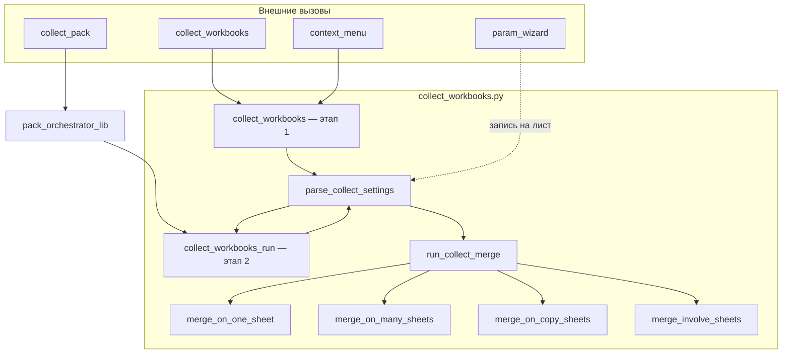
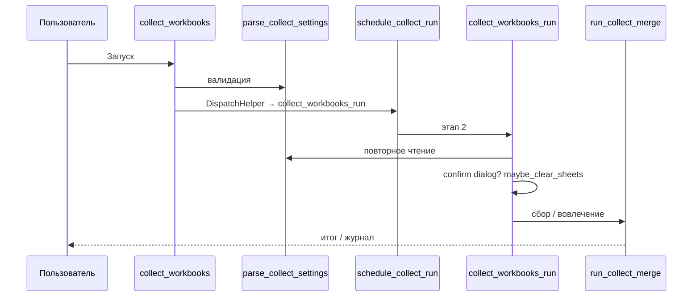

# Архитектура макроса `collect_workbooks` / `collect_pack`

**Файл:** `macro-lib/collect_workbooks.py`  
**Версия:** **3.10.711**  
**Связанные модули:** `pythonpath/libre_macros_lib.py`, `libre_macros_direct_lib.py`, `libre_macros_split_lib.py`, `libre_macros_header_lib.py`, `libre_macros_lambda_column_lib.py`, `libre_macros_pack_orchestrator_lib.py`, `libre_macros_final_lib.py`, `libre_macros_sanitize_lib.py`, `libre_macros_source_roots_*.py`, `libre_macros_allow_gate_lib.py`, `libre_macros_pre_shell_*.py`, `param_wizard.py`, `functions_pp.py`, `functions_final.py`

Параметры — [04_DATA_COLLECTION.md](04_DATA_COLLECTION.md); оркестратор — [18_ORCHESTRATOR.md](18_ORCHESTRATOR.md); постобработка — [05_POSTPROCESS.md](05_POSTPROCESS.md); `xml_excel_ods` — [17_POSTPROCESS_XML.md](17_POSTPROCESS_XML.md); визард — [06_PARAM_WIZARD.md](06_PARAM_WIZARD.md); безопасность — [19_SECURITY.md](19_SECURITY.md).

Детальный разбор режима «На один лист» с привязкой к функциям — [10_MERGE_ALGORITHM.md](10_MERGE_ALGORITHM.md) (номера строк в нём могут отставать от кода; ориентируйтесь на имена функций).

---

## 1. Обзор

Макрос объединяет или обрабатывает данные в **текущей книге результата** по таблице на листе(ах) `Параметры_Объединения*`.

| Слой | Ответственность |
|------|-----------------|
| **collect_workbooks.py** | Entry: этапы 1–2, диспетчер режимов, UI, тонкая обёртка `collect_pack` |
| **libre_macros_pack_orchestrator_*** | Диалог / persist оркестратора |
| **libre_macros_lib.py** | `lm_pp_*`, ВПР, merge sheets, раскраска, … |
| **libre_macros_direct_lib.py** | Direct `xml_excel_ods` |
| **libre_macros_split_lib.py** | `разделить_листы` |
| **libre_macros_header_lib.py** | Многоэтажные заголовки, flatten merge в памяти |
| **libre_macros_lambda_column_lib.py** | `столбец_по_лямбде`, sugar `rows`/`upd_rows` |
| **libre_macros_final_lib.py** / **values_lib** | Финальные шаги |
| **libre_macros_param_codec.py** | JSON encode/decode колонки C |
| **param_wizard.py** | Редактирование листа параметров |
| **functions_pp.py** / **functions_final.py** | Плагины пользователя |

---

## 2. Точки входа

| Функция | Назначение |
|---------|------------|
| `collect_workbooks()` | Этап 1: валидация, планирование этапа 2 |
| `collect_workbooks_run()` | Этап 2: сбор / вовлечение, pipeline, итог |
| `collect_pack()` | Оркестратор нескольких листов параметров |
| `collect_reset_db_ranges()` | Сброс DatabaseRange + простой автофильтр |
| `collect_workbooks_reopen()` | Служебный reopen |
| `merge_xml_deferred_anchor_close()` | Закрытие якоря после xml deferred |
| `set_merge_param()` | Визард (`param_wizard`) |

Этап 2 вызывается через `schedule_collect_run` (dispatch): после `loadComponentFromURL` поток в том же Python-вызове часто обрывается.

---

## 3. Двухэтапный запуск

| Функция | Примечание |
|---------|------------|
| `maybe_clear_sheets` | На **этапе 2** после подтверждения. В INVOLVE и на pack[1+] — подавляется |
| `merge_ui_dialog_confirm_run` | Если `Отображение_прогресса` = диалог |
| `run_collect_merge` | `merge_on_one` / `many` / `copy` / **`involve`** |

Оркестратор: [18_ORCHESTRATOR.md](18_ORCHESTRATOR.md).

---

## 4. `parse_collect_settings`

Единая точка конфигурации. Возвращает `settings`: `files`, `is_current_book_flags`, `mode`, `per_file_*`, `data_transfer_mode`, `processing_pipeline`, `sheets_undelete`, цепочки постобработки/финала.

Нормализация режима: `_normalize_collect_merge_mode`. Маркер книги: `is_current_book_marker` / `merge_normalize_current_book_marker_key`.

---

## 5. Диспетчер режимов

| Режим | Константа | Функция | Примечание |
|-------|-----------|---------|------------|
| На один лист | `MERGE_MODE_ONE` | `merge_on_one_sheet` | Служебные колонки опционально |
| На разные листы | `MERGE_MODE_MANY` | `merge_on_many_sheets` | |
| Копирование листов | `MERGE_MODE_COPY` | `merge_on_copy_sheets` | Без `#Путь` / `#Дата` |
| **Вовлечь листы** | `MERGE_MODE_INVOLVE` | `merge_involve_sheets` | Только эта_книга; без переноса; pre-clear off |

Ветка `xml_excel_ods` — до `merge_on_*`, **не** для INVOLVE.

Хвост: оформление (с учётом preexisting) → book pipeline → `Финальная_обработка`.

---

## 6. Модули `pythonpath/`

| Модуль | Роль |
|--------|------|
| `libre_macros_collect_cfg.py` | Константы, maps, маркеры, режимы |
| `libre_macros_lib.py` | Ядро постобработки |
| `libre_macros_direct_lib.py` | xml_excel_ods |
| `libre_macros_split_lib.py` | разделить_листы |
| `libre_macros_pack_orchestrator_lib.py` | collect_pack UI |
| `libre_macros_param_codec.py` | JSON C |
| `libre_macros_pivot_lib.py` | Сводные |
| `libre_macros_consent_lib.py` | Согласие перед запуском |
| `libre_macros_sanitize_lib.py` | AST-санация B/C / лямбд (fail-closed) |
| `libre_macros_source_roots_cfg.py` / `_lib.py` | Доверенные корни «Файлы-Источники» |
| `libre_macros_allow_gate_lib.py` | Гейт env ↔ encrypted global |
| `libre_macros_pre_shell_cfg.py` / `_lib.py` | Предварительный_скрипт |

Entry-скрипты (`macro-lib/*.py`) при установке → `Scripts/python/`. Фильтр **AlterOffice 2026** вырезает module-level присваивания — константы в `pythonpath/` ([03_INSTALL_DEV.md](03_INSTALL_DEV.md)).

---

## 7. Pipeline kinds

| kind | Параметр A |
|------|------------|
| `range` | `Постобработка_Диапазон` |
| `row` | `Постобработка_Строка` |
| `vlookup` | `ВПР` |
| `merge_sheets` | `объединить_листы_в_один` |
| `split_sheets` | `разделить_листы` |

Порядок: range/splitters, затем только row. XML-pipeline — отдельно для direct.

---

*Документ соответствует `MACRO_VERSION` **3.10.696**.*
