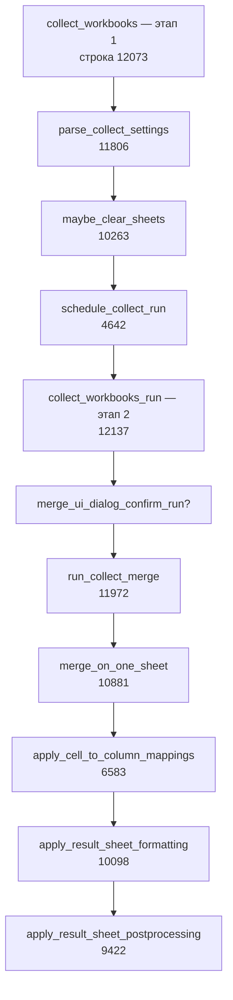
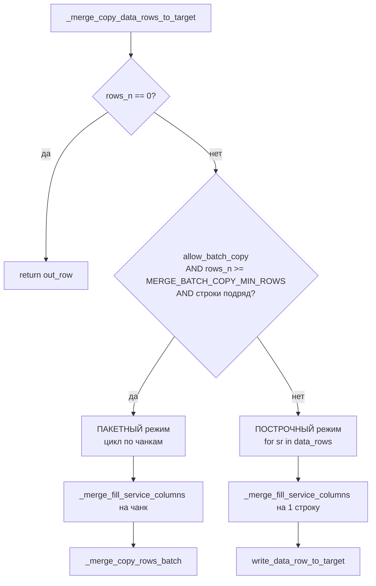
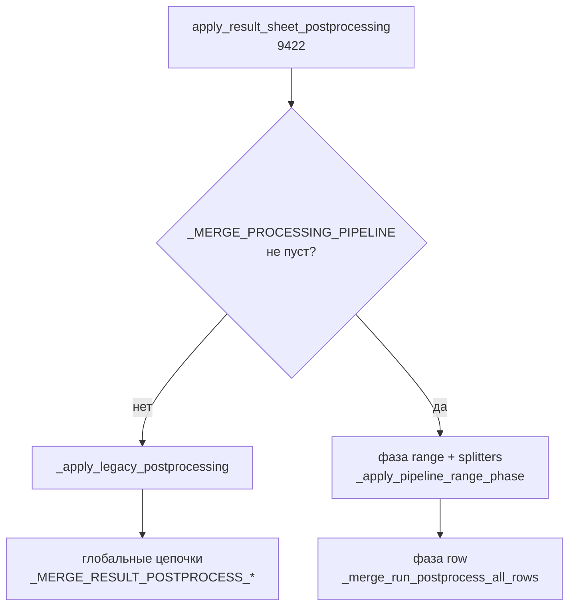

# Алгоритм сбора данных: режим «На один лист»

**Исходный код:** [`collect_workbooks.py`](../macro-lib/collect_workbooks.py)  
**Режим:** `MERGE_MODE_ONE` = `"на один лист"` (параметр **Режим** на листе `Параметры_Объединения*`)  
**Версия документа:** ориентир на **3.10.696**; **номера строк устаревают** — ищите по именам функций.

Связанные документы: [04_DATA_COLLECTION.md](04_DATA_COLLECTION.md), [09_ARCHITECTURE.md](09_ARCHITECTURE.md), [05_POSTPROCESS.md](05_POSTPROCESS.md), [15_PARAM_REFERENCE.md](15_PARAM_REFERENCE.md), [18_ORCHESTRATOR.md](18_ORCHESTRATOR.md).

> При правках кода строки сдвигаются. Режимы COPY / MANY / **INVOLVE** и оркестратор `collect_pack` описаны в [04](04_DATA_COLLECTION.md) и [09](09_ARCHITECTURE.md); этот файл детализирует ветку ONE.

---

## 0. Предусловия

Перед запуском на листе параметров должны быть заданы (см. `parse_collect_settings`, **11806**):

| Параметр (A) | Роль в режиме ONE |
|--------------|-------------------|
| `Файлы-Источники` | Список путей или `Эта_Книга` |
| `Режим` | `На один лист` (или синоним без нормализации в COPY) |
| `Листы` | Какие листы **источника** читать (INDEX / NAME / ALL) |
| `Столбцы` | Какие столбцы копировать |
| `Начало_Строка`, `Начало_Столбец`, `Число_*`, `Строка_Заголовков` | Блок данных на листе источника |
| `Источник_в_первой_колонке` | Включить колонку `#Путь` |
| `Дата_источника_во_второй__колонке` | Включить колонку `#ДатаВремяФайла` |
| `Пропуск_строк_источника` | Опциональный фильтр строк до копирования |
| `Ячейка_В_Столбец` | Опционально — после копирования |
| `Постобработка_*`, `ВПР`, `объединить_листы_в_один`, `разделить_листы` | Опционально — после оформления (merge/split — отдельные строки A) |

**Ключевая идея режима ONE:** независимо от фильтра листов источника **все данные пишутся в один лист `Merge`**. Столбцы на результате **сливаются по имени заголовка** (строка 0), а не по позиции в источнике.

---

## 1. Общая схема (два этапа)



---

## 2. Этап 1 — подготовка (`collect_workbooks`)

**Функция:** `collect_workbooks()` — **строки 12073–12134**

| Шаг | Действие | Функция | Строки | Комментарий |
|-----|----------|---------|--------|-------------|
| 1.1 | Загрузить `libre_macros_lib` | `_ensure_pp_from_lib()` | (конец файла) | Карты постобработки, shims |
| 1.2 | Определить книгу результата | `get_run_target_doc()` | — | Активная Calc-книга |
| 1.3 | Проверить наличие листа параметров | `list_param_sheet_names()` | — | Иначе подсказка переключить книгу |
| 1.4 | Запомнить книгу и сбросить кэш листа параметров | `set_run_target_doc`, `set_run_param_sheet(None)` | — | Для этапа 2 |
| 1.5 | Закрыть «зависшие» скрытые документы и источники | `close_orphan_hidden_documents`, `close_all_open_sources` | — | Чистый старт |
| 1.6 | **Прочитать и провалидировать все параметры** | `parse_collect_settings(doc)` | **11806** | При ошибке — `show_message`, выход |
| 1.7 | Записать статус на лист | `write_status_log` | — | «Этап 1 OK…» |
| 1.8 | Опционально удалить лишние листы книги | `maybe_clear_sheets` | **10263** | Только если есть лист параметров; уважает `Листы_не_удалять` |
| 1.9 | Запланировать этап 2 через dispatch | `schedule_collect_run(doc)` | **4642** | Отдельный вызов Python — обход обрыва после `loadComponentFromURL` |
| 1.10 | Fallback: прямой этап 2 | `collect_workbooks_run()` | **12137** | Если dispatch недоступен |

### 2.1. Что делает `parse_collect_settings` для режима ONE

**Строки 11806–11969** (фрагменты):

1. `resolve_param_sheet_for_run` / `read_param_table` — таблица A/B/C…
2. `expand_source_files` — маски → список файлов, флаги `Эта_Книга`
3. `mode = first_value(table, P_MERGE_MODE, "На один лист").strip().lower()` — **11850**; если не COPY → остаётся `"на один лист"`
4. `build_per_file_sheet_specs`, `build_per_file_col_specs`, `build_per_file_block_settings`, `build_per_file_skip_row_specs`
5. `classify_sheet_specs` / `classify_column_specs` — тип фильтра (ALL / INDEX / NAME / …); **MIXED** → ошибка
6. `build_processing_pipeline` — unified pipeline (Диапазон / Строка / ВПР / объединить_листы_в_один / разделить_листы)
7. Возврат `settings` dict для `run_collect_merge`

---

## 3. Этап 2 — запуск сбора (`collect_workbooks_run`)

**Функция:** `collect_workbooks_run()` — **строки 12137–12350+**

| Шаг | Действие | Функция | Строки |
|-----|----------|---------|--------|
| 3.1 | Повторно прочитать параметры | `parse_collect_settings` | 12164 |
| 3.2 | Сброс журнала | `reset_collect_log` | — |
| 3.3 | Создать отчёт прогресса | `ProgressReport(estimate_work_steps(...))` | 12235 |
| 3.4 | Применить флаги UI | `_merge_apply_flags_from_settings`, `merge_ui_bind_settings` | 12238–12240 |
| 3.5 | **Диалог подтверждения** (если `Отображение_прогресса` = диалог) | `merge_ui_dialog_confirm_run` | 12242–12254 |
| 3.6 | **Запуск диспетчера режимов** | `run_collect_merge(doc, settings, report)` | **12271** |
| 3.7 | Итог, лог, закрытие источников | `finally`: `close_all_open_sources`, `append_collect_log` | 12306+ |

---

## 4. Диспетчер: `run_collect_merge`

**Строки 11972–12070**

| Шаг | Действие | Строки |
|-----|----------|--------|
| 4.1 | UI: фаза «Сбор данных» | 11994–11995 |
| 4.2 | Записать в глобали pipeline и цепочки постобработки | 11999–12007 |
| 4.3 | Лог шагов постобработки на лист «Сбор_книг_лог» | 12008–12022 |
| 4.4 | `merge_run_context_begin(settings)` | 12025 |
| 4.5 | Отключить авто-пересчёт книги | `_merge_doc_auto_calc(doc, False)` | 12026 |
| 4.6 | **Если `mode == MERGE_MODE_ONE`** → `merge_on_one_sheet(...)` | **12028–12040** |
| 4.7 | В `finally` — включить авто-пересчёт | 12069–12070 |

Аргументы в `merge_on_one_sheet` передаются из `settings`: файлы, per-file спецификации, `path_display`, `cell_to_column_plan`, `report`.

---

## 5. Ядро: `merge_on_one_sheet` — пошагово

**Функция:** `merge_on_one_sheet` — **строки 10881–11170**

### Фаза A. Инициализация листа `Merge`

| Шаг | Код (примерно) | Функция | Строки | Пояснение |
|-----|----------------|---------|--------|-----------|
| A.1 | `target_key = MERGE_ONE_SHEET_TARGET_NAME` | — | 10913 | Всегда `"Merge"` |
| A.2 | `ts, out_row = prepare_target_sheet(...)` | `prepare_target_sheet` | **10917**, **8620** | Создать лист или взять существующий |
| A.3 | — | `ensure_service_headers(ts)` | **10925**, **7172** | Заголовки `#Путь` / `#ДатаВремяФайла` в строке 0 (если включены в layout) |
| A.4 | Подготовка кэша «Ячейка_В_Столбец» | `build_cell_to_column_per_file_specs` | 10928–10931 | Читается позже, после копирования |

#### `prepare_target_sheet` (**8620–8678**)

1. `get_sheet` → если нет — `insertNewByName(tname)` (**8643–8649**).
2. `ensure_service_headers` (**8656**).
3. Если на листе уже есть данные и имя ещё не в `cleared_names` — вопрос пользователю: очистить или дописать (**8658–8675**).
   - **Да** — удалить лист и создать заново на том же индексе (быстрее полной очистки).
   - **Нет** — дописывание в конец.
4. `out_row = _merge_resolve_out_row(ts, start=1)` — первая пустая строка по колонке `#Путь` (**8677**).

---

### Фаза B. Цикл по файлам-источникам

**Цикл:** `while fi < len(files)` — **строки 10933–11131**

| Шаг | Действие | Строки | Пояснение |
|-----|----------|--------|-----------|
| B.0 | Прерывание? | `_merge_stop_if_aborted(report)` | 10935 | Кнопка «Прервать» в диалоге |
| B.1 | Определить тип источника | `is_current_book_flags[fi]` | 10938–10940 | `True` = та же книга, что результат |
| B.2a | **Текущая книга** | `src = target_doc` | 10943–10948 | Файл не открывается |
| B.2b | **Внешний файл** | `open_source(fpath, writable=…)` | **10950–10961**, **6892** | Скрытое RO-открытие; `writable` если нужен skip с удалением строк на источнике |
| B.3 | Параметры блока данных | `per_file_blocks[fi]` → `start_col`, `row_count`, `col_count` | 10963–10971 | Строка/столбец начала, число строк/столбцов |
| B.4 | Классификация фильтров | `classify_sheet_specs`, `classify_column_specs` | 10977–10978 | ALL / INDEX / NAME для листов; ALL / INDEX / LETTER / NAME для столбцов |
| B.5 | Ошибка открытия | `src is None` → `report.problem`, `continue` | 10989–10992 | Следующий файл |

---

### Фаза C. Цикл по листам источника (внутри файла)

**Цикл:** `for slot in slots` — **строки 11004–11124**

| Шаг | Действие | Функция | Строки |
|-----|----------|---------|--------|
| C.1 | Получить слоты листов | `iter_sheet_slots` или `_iter_sheet_slots_current_book` | **10996–11001**, **7086**, **7157** |
| C.2 | Открыть лист источника | `get_sheet(src, tname)` | 11008 | `tname = slot["source_name"]` |
| C.3 | Строка заголовков блока | `_merge_resolve_block_hdr_row(ss, blk)` | 11024 | Из параметра `Строка_Заголовков` |
| C.4 | **Список столбцов для копирования** | `build_column_list(...)` | **11025–11027**, **7870** |
| C.5 | Пустой список столбцов → пропуск листа | — | 11028–11045 | |
| C.6 | Prefetch для «Ячейка_В_Столбец» | `maybe_prefetch_cell_to_column` | 11053–11062 | |
| C.7 | **Зарегистрировать заголовки на Merge** | `ensure_target_headers(ts, cols)` | **11065**, **7225** |
| C.8 | **Подготовить строки данных + skip** | `_merge_prepare_data_rows_with_skip` | **11070–11082**, **8405** |
| C.9 | **Скопировать строки на Merge** | `_merge_copy_data_rows_to_target` | **11095–11111**, **7420** |
| C.10 | Лог по каждому столбцу | `report.log_stat` | 11112–11124 | |

#### C.1. `iter_sheet_slots` (**7086–7146**)

Генерирует словари `{target_key, source_name, source_index}`:

- **ALL** — все листы книги источника.
- **INDEX** — листы по номерам из `Листы` (1-based в параметре).
- **NAME** — листы, имя которых совпадает с шаблоном (`text_match`).

> В режиме ONE поле `target_key` из слота **не используется** для выбора листа результата — всегда пишем в `ts` (`Merge`). Фильтр влияет только на **какие листы источника** читать.

#### C.4. `build_column_list` (**7870+**)

Возвращает `[(col_index, header_text), …]`:

- Исключает служебные заголовки `#Путь` / `#ДатаВремяФайла` (**7904–7907**).
- Режимы: все столбцы от `Начало_Столбец`, по номерам, по буквам, по имени заголовка.

#### C.7. Слияние столбцов по заголовку

`ensure_target_headers` → для каждого заголовка `find_or_create_header_column(ts, hname)` (**7190–7221**):

1. Ищет столбец на `Merge` с тем же заголовком в строке 0 (сравнение через `merge_identity_key`).
2. Если не найден — занимает первый пустой столбец справа от служебных колонок (`merge_get_first_data_col()`).
3. Порядок столбцов на `Merge` = порядок **первого появления** имени при обходе файлов/листов.

#### C.8. `_merge_prepare_data_rows_with_skip` (**8405+**)

1. `data_rows_from_sheet` — индексы строк данных (ниже `hdr_row`) в блоке.
2. Если `Пропуск_строк_источника` пуст — вернуть все строки, разрешить пакетное копирование.
3. Иначе — фильтр по столбцам или формуле:
   - **Внешний файл:** может физически удалить строки на листе источника (`_merge_source_apply_skip_rows`), затем перечитать список.
   - **Текущая книга:** только отбор индексов, без изменения листов пользователя.

#### C.9. `_merge_copy_data_rows_to_target` (**7420+**)

1. Заполнить служебные колонки для блока строк: `_merge_fill_service_columns` (**7305+**) — путь к файлу, дата/время файла (или значения из одноимённых колонок источника, если они есть).
2. **Пакетный режим** (если ≥ `MERGE_BATCH_COPY_MIN_ROWS` и строки подряд): `_merge_copy_rows_batch` — **7507–7518**.
3. **Построчный режим:** цикл с `write_data_row_to_target` — **7238–7278**.

##### `write_data_row_to_target` (**7238–7278**) — одна строка

Для каждой пары `(sc, hname)` из `cols`:

1. `tc = find_or_create_header_column(ts, hname)` — столбец на `Merge` по **имени**, не по `sc`.
2. `_merge_copy_cell_value_and_format(src_cell, dst_cell, …)` — значение + числовой формат + стили.

`out_row` увеличивается на число скопированных строк; все листы и файлы **дописывают в конец** одного `Merge`.

---

### 5.1. Детальная механика переноса строк (источник → `Merge`)

#### Буфер обмена

**Нет — в режиме «На один лист» буфер обмена не используется.**

Копирование идёт напрямую через **UNO API** Calc:

| Уровень | Механизм | Функции |
|---------|----------|---------|
| Пакет (много строк) | `XCellRange.getDataArray()` → `setDataArray()` | `_merge_copy_range_data_and_format` (**5194**) |
| Построчно (одна ячейка) | чтение свойств `XCell` → запись в другую `XCell` | `_snapshot_cell_content` (**5302**) → `_apply_cell_snapshot` (**5376**) |

Команды `.uno:Copy` / `.uno:Paste` и `dispatch` к буферу в этом режиме **не вызываются**.

> **Где буфер/диспетчер всё же есть в проекте (не для ONE):**
> - режим **«Копирование листов»** — `XSpreadsheets2.importSheet` для книг; для **`.csv`** — чтение текста → матрица → `setDataArray` на новый лист;
> - постобработка в `libre_macros_lib.py` — отдельные шаги могут вызывать `.uno:Copy` для пользовательских операций.

---

#### Дерево решений: пакет или построчно

Точка входа — `_merge_copy_data_rows_to_target` (**7420**). Режим выбирается **один раз** на весь список `data_rows` листа:



**Условия пакетного режима** (строки **7461–7465**):

| Условие | Константа / функция | По умолчанию | Смысл |
|---------|---------------------|--------------|-------|
| `allow_batch_copy == True` | из `_merge_prepare_data_rows_with_skip` | `True` | После фильтра «Пропуск_строк» с **разрывами** в индексах → `False` (**8495**) |
| `rows_n >= MERGE_BATCH_COPY_MIN_ROWS` | **2922** | **100** | Меньше 100 строк — всегда построчно |
| `_merge_rows_are_consecutive(data_rows)` | **3866** | — | Индексы 5,6,7…; после skip с дырками — построчно |

**Типичные случаи построчного режима:**

- меньше 100 строк данных на лист;
- `Пропуск_строк_источника` отфильтровал строки **не подряд** (`Эта_Книга` + skip → **8495**);
- `MERGE_BATCH_COPY_MIN_ROWS = 0` на листе параметров (расширенный параметр, **2897**).

---

#### Константы чанков (два уровня вложенности)

В пакетном режиме чанки **дважды** ограничивают размер блока:

| Константа | Строка | По умолчанию | Роль |
|-----------|--------|--------------|------|
| `MERGE_BATCH_COPY_MIN_ROWS` | 2922 | 100 | Порог «включить пакетный режим вообще» |
| `MERGE_COPY_ROW_CHUNK` | 2919 | **1000** | Макс. строк в одном `getDataArray`/`setDataArray` |
| `_MERGE_UI_DIALOG_COPY_CHUNK` | 2956 | **50** | В режиме «Диалог» — чаще обновлять UI |

Фактический размер чанка в пакетном цикле — `_merge_ui_dialog_copy_chunk()` (**3694**):

- **Диалог прогресса:** `min(MERGE_COPY_ROW_CHUNK, 50)` → обычно **50 строк** за итерацию внешнего цикла;
- **Статусная строка:** `MERGE_COPY_ROW_CHUNK` → до **1000 строк** за итерацию.

Внешний цикл (**7468–7534**): `chunk = data_rows[di : di + copy_chunk]` → служебные колонки → `_merge_copy_rows_batch` → `out_row += len(chunk)`.

---

#### Пакетный путь (batch) — пошагово

**1. Служебные колонки** — `_merge_fill_service_columns` (**7305**) на весь чанк сразу:

- `#Путь`, `#ДатаВремяФайла` — текстом в каждую строку чанка;
- если в источнике уже есть одноимённые колонки — берутся их значения (**7356–7344**).

**2. Данные по столбцам** — `_merge_copy_rows_batch` (**7364**):

> Важно: пакет копирует **по одному столбцу за раз**, а не прямоугольник «все cols × все rows» одним вызовом.

Для каждого `(sc, hname)` из `cols`:

1. `tc = find_or_create_header_column(ts, hname)` — столбец на `Merge` по **имени заголовка**;
2. диапазон источника: строки `sr0…sr1` (первый/последний индекс чанка), столбец `sc`;
3. диапазон приёмника: те же `len(chunk)` строк начиная с `out_row`, столбец `tc`;
4. вызов `_merge_copy_range_data_and_format` (**5194**).

**3. Внутри `_merge_copy_range_data_and_format`:**

```
src_range = ss.getCellRangeByPosition(sc0, sr0, sc1, sr1)
dst_range = ds.getCellRangeByPosition(tc0, tr0, tc1, tr1)
raw       = src_range.getDataArray()                    # чтение блока в память Python
data, empty_pos = _merge_prepare_data_array_respecting_empty(...)  # пустые ячейки → ""
dst_range.setDataArray(data)                            # запись блока
dst_range.NumberFormat = ...  # числовой формат с верхней левой ячейки источника
_merge_clear_empty_positions(...)  # точечная очистка ячеек, которые LO после формата превратил в 0
```

Подготовка массива (**5135**): для значений `''`, `0`, `None` дополнительно проверяется `getCellByPosition` — отличить **пустую** ячейку с числовым форматом от **реального нуля**.

**Что копируется в пакетном режиме:**

| Свойство | Пакетный |
|----------|----------|
| Значения (числа, текст, результат формулы как значение) | **Да** (`setDataArray`) |
| Числовой формат (дата, деньги, %) | **Да** (на весь диапазон) |
| Шрифт, цвет, фон, выравнивание | **Нет** |
| Формулы как формулы | **Нет** — в массив попадает **вычисленное значение** |

---

#### Построчный путь (row-by-row) — пошагово

Цикл **7541–7580**: для каждого `sr` из `data_rows`:

1. `_merge_fill_service_columns(..., count=1)` — служебные поля одной строки;
2. `write_data_row_to_target(ts, out_row, cols, ss, sr, …)` (**7238**);
3. `out_row += 1`;
4. `merge_ui_yield(counter=row_num)` — каждые `MERGE_UI_YIELD_EVERY_ROWS` строк (**3877**, по умолчанию **10**), чтобы Calc не «зависал».

**Внутри `write_data_row_to_target`** — цикл по `cols`:

```
src_cell = source_sheet.getCellByPosition(sc, source_row)
dst_cell = ts.getCellByPosition(tc, out_row)
_merge_copy_cell_value_and_format(src_cell, dst_cell, src_doc, dst_doc, ...)
```

**`_merge_copy_cell_value_and_format`** (**5450**) — две фазы:

1. **`_merge_copy_cell_content`** (**5428**) — только значение:
   - снимок `_snapshot_cell_content`: `ctype`, `String`, `Value`, `cell_text`;
   - запись `_apply_cell_snapshot` (**5376**):
     - `FORMULA` (ctype=3) → сначала `String` (текст формулы), иначе `Value`;
     - числа/даты (ctype=1) → `Value`, если `_snapshot_should_copy_as_value`;
     - текст (ctype=2) → `String`;
     - пустая → `_merge_clear_cell_content`.
2. **`_merge_copy_cell_format`** (**4989**) — визуальное оформление **каждой ячейки**:
   - числовой формат (с переносом шаблона между книгами через `_merge_copy_cell_number_format` **4913**);
   - фон, шрифт, цвет, выравнивание, перенос текста.

**Что копируется построчно:**

| Свойство | Построчный |
|----------|------------|
| Значения | **Да** |
| Числовой формат | **Да** |
| Шрифт, цвет, фон, выравнивание | **Да** |
| Формулы | как **текст формулы** (`String`) или **значение**, не пересчёт на приёмнике |

---

#### Сводная схема потока данных

```
data_rows = [12, 13, 14, …, 1111]   # 0-based индексы строк источника
cols      = [(3,"Сумма"), (5,"Дата"), …]

ПАКЕТНЫЙ (≥100 строк, подряд, allow_batch_copy):
  чанк [12..61]  (50 строк в диалоге)
    #Путь, #Дата → _merge_fill_service_columns (50 строк)
    столбец "Сумма":  ss[3,12:61]  --getDataArray/setDataArray-->  Merge[tc_Сумма, out_row:out_row+49]
    столбец "Дата":   ss[5,12:61]  --getDataArray/setDataArray-->  Merge[tc_Дата,   out_row:out_row+49]
    …
    out_row += 50
  чанк [62..111] …

ПОСТРОЧНЫЙ:
  для sr=12:
    #Путь, #Дата → 1 строка
    для каждого столбца: getCellByPosition → snapshot → apply + format
    out_row += 1
```

**Маппинг столбцов** в обоих режимах одинаковый: позиция `sc` в источнике → столбец `tc` на `Merge` по **тексту заголовка** `hname`, не по номеру столбца.

---

#### Откуда берётся `allow_batch_copy`

`_merge_prepare_data_rows_with_skip` (**8405**) возвращает третий элемент кортежа:

| Ситуация | `allow_batch_copy` | Строка |
|----------|-------------------|--------|
| Нет фильтра skip | `True` | 8440 |
| Skip на внешнем файле (удаление строк на источнике) | `True` | 8485 |
| Skip на `Эта_Книга` (только отбор индексов) | **`False`** | 8495 |
| Ошибка столбцов в skip-спецификации | `True` (данные без фильтра) | 8461 |

При `False` даже 10 000 подряд идущих строк пойдут **построчно** — это защита от разреженных индексов после фильтра.

---

#### Настройка через лист параметров

Расширенные параметры (колонка A = имя константы, B = число), см. **2893–2923**:

- `MERGE_BATCH_COPY_MIN_ROWS=0` — пакетный режим с любого количества строк;
- `MERGE_COPY_ROW_CHUNK=500` — больше строк за один `getDataArray`;
- `MERGE_UI_YIELD_EVERY_ROWS=50` — реже отдавать UI в построчном режиме.

---

### Фаза D. Завершение файла

| Шаг | Действие | Строки |
|-----|----------|--------|
| D.1 | `finally`: закрыть источник | `close_source(src)` | 11125–11127 | Не для `Эта_Книга` |
| D.2 | UI yield | `merge_ui_yield` | 11130 |
| D.3 | Следующий файл | `fi += 1` | 11131 |

---

### Фаза E. После всех файлов

| Условие | Действие | Строки |
|---------|----------|--------|
| Прервано пользователем | Частичное применение CTC + formatting, `return any_sheet` | **11133–11148** |
| `not any_sheet` | `report.problem("Нет листов/столбцов…")`, `return False` | **11150–11152** |
| Успех | См. фазу F | **11154–11170** |

---

## 6. Фаза F. Постобработка копирования (всё ещё `merge_on_one_sheet`)

Выполняется **один раз** для единственного листа `ts` (`Merge`):

| Шаг | Функция | Строки | Назначение |
|-----|---------|--------|------------|
| F.1 | `apply_cell_to_column_mappings` | **11154–11162**, **6583** | Параметр `Ячейка_В_Столбец`: значения из ячеек источников → новые столбцы |
| F.2 | `apply_result_sheet_formatting` | **11165**, **10098** | Встроенное оформление + постобработка + автофильтр/freeze |
| F.3 | `activate_sheet` | 11166 | Перейти на лист `Merge` |
| F.4 | `refresh_document` | 11169 | Обновить экран |

---

## 7. `apply_result_sheet_formatting` — что происходит на `Merge`

**Строки 10098–10260**

| # | Шаг | Строки (порядок) |
|---|-----|------------------|
| 7.1 | Границы листа `get_sheet_used_bounds` | 10137–10138 |
| 7.2 | Шрифт данных по умолчанию | 10151–10158 |
| 7.3 | Оформление строки заголовков (если нет зебры в постобработке) | 10164–10181 |
| 7.4 | Автоподбор ширины столбцов | 10185–10186 |
| 7.5 | Отступ и ограничение ширины (max 3″) | 10187–10189 |
| 7.6 | Выравнивание диапазона | 10191–10193 |
| 7.7 | Автоподбор высоты строк | 10195–10225 |
| 7.8 | **`apply_result_sheet_postprocessing`** | **10234** |
| 7.9 | Автофильтр и freeze (флаги `MERGE_RESULT_AUTOFILTER`, `MERGE_FREEZE_HEADER`) | 10240 |
| 7.10 | Финализация заголовка после возможных новых столбцов | 10245–10252 |

---

## 8. `apply_result_sheet_postprocessing` — pipeline и legacy

**Строки 9422+**



Для режима ONE pipeline строится в `build_processing_pipeline` из строк листа параметров:

- `Постобработка_Диапазон` → `kind: range`
- `ВПР` → `kind: vlookup` → `_merge_run_vlookup` → `lm.lm_vlookup_join_sheets`
- `объединить_листы_в_один` → `kind: merge_sheets` (имя в **A**, JSON в C; не ключ B Диапазон)
- `разделить_листы` → `kind: split_sheets` (`libre_macros_split_lib`)
- `Постобработка_Строка` → `kind: row`

**Порядок:** блоки `range` и splitters (`vlookup` / `merge_sheets` / `split_sheets`) могут чередоваться; затем все `row` (`validate_processing_pipeline_order`).

ВПР выполняется только если `left_sheet` из спецификации совпадает с текущим листом (`Merge` или как переименован). `merge_sheets` выполняется **один раз** на шаг (не «на лист»).

---

## 9. Сводка потока данных (источник → Merge)

```
Файл-источник
  └─ open_source (или target_doc для Эта_Книга)
       └─ iter_sheet_slots → лист ss
            └─ build_column_list → [(sc, заголовок), …]
                 └─ ensure_target_headers / find_or_create_header_column на Merge
                      └─ _merge_prepare_data_rows_with_skip → [номера строк]
                           └─ _merge_copy_data_rows_to_target
                                ├─ _merge_fill_service_columns (#Путь, #Дата)
                                └─ write_data_row_to_target / _merge_copy_rows_batch
                                     └─ _merge_copy_cell_value_and_format
                                          → ячейка Merge[out_row][tc по заголовку]
```

---

## 10. Таблица «событие → функция → строка»

| Событие | Функция | Строка |
|---------|---------|--------|
| Пользователь запустил макрос | `collect_workbooks` | 12073 |
| Чтение параметров | `parse_collect_settings` | 11806 |
| Режим = на один лист | `run_collect_merge` → ветка ONE | 12028 |
| Создание/очистка Merge | `prepare_target_sheet` | 8620 |
| Открытие файла | `open_source` | 6892 |
| Выбор листов источника | `iter_sheet_slots` | 7086 |
| Выбор столбцов | `build_column_list` | 7870 |
| Слияние заголовков | `find_or_create_header_column` | 7190 |
| Фильтр строк | `_merge_prepare_data_rows_with_skip` | 8405 |
| Копирование | `_merge_copy_data_rows_to_target` | 7420 |
| Ячейка → столбец | `apply_cell_to_column_mappings` | 6583 |
| Оформление | `apply_result_sheet_formatting` | 10098 |
| ВПР / постобработка | `apply_result_sheet_postprocessing` | 9422 |

---

## 11. Отличия от других режимов (кратко)

| Аспект | На один лист (ONE) | На разные листы (MANY) | Копирование листов (COPY) |
|--------|-------------------|------------------------|---------------------------|
| Лист(ы) результата | Один `Merge` | `Merge_N` или по имени | Копии вкладок |
| Слияние столбцов по заголовку | **Да** | Зависит от ветки | Нет (целый лист) |
| `apply_result_sheet_formatting` | **Да** | **Да** | **Нет** |
| `apply_cell_to_column_mappings` | **Да** | **Да** | **Нет** |

---

*Документ описывает алгоритм по коду `collect_workbooks.py` (ветка `merge_on_one_sheet`). Для полной архитектуры модуля см. [09_ARCHITECTURE.md](09_ARCHITECTURE.md).*
